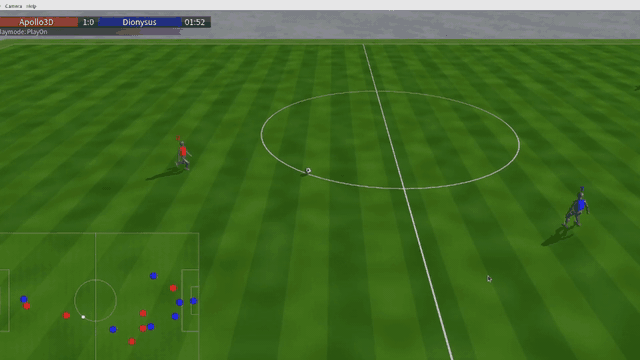

# Apollo Codebase

[](LICENSE.md)
[](https://isocpp.org/)
[](https://www.kernel.org/)
[](https://github.com/XiangruiJiang/ApolloCodebase/stargazers)

<p align="center">
  
</p>

> A RoboCup Soccer Simulation 3D team for the T1 robot on [RCSSServerMJ](https://gitlab.com/robocup-sim/rcssservermj), combining role assignment, formation control, obstacle-aware walking, learned motion policies, and inter-agent communication.

## Overview

Apollo Codebase is a complete seven-agent soccer client for the MuJoCo-based RoboCup Soccer Simulation server developed by Apollo3D. Each agent maintains its own world model, exchanges compact team messages, selects a role and formation position, and executes walking or recovery motions through ONNX policies.

## Repository Layout

```text
ApolloCodebase/
├── src/
│   ├── app/             # process entry, argument parsing, and agent lifecycle
│   ├── behavior/        # walk, get-up, and keyframe motion runners
│   ├── comm/            # compact inter-agent communication
│   ├── decision/        # behavior tree, roles, formations, and walk planning
│   ├── math/            # shared geometry helpers
│   ├── robot/           # T1 robot model and joint definitions
│   ├── server/          # RCSSServerMJ transport, parser, and action encoder
│   └── world/           # world model, frame normalization, and ball filtering
├── assets/
│   ├── networks/        # learned walk and get-up policies
│   └── keyframes/       # neutral-pose keyframes
├── CMakeLists.txt       # CMake build definition
├── start.sh             # launch seven agents
├── kill.sh              # stop the team
└── pack.sh              # build a self-contained deployment archive
```

## Requirements

- Linux x86_64
- A C++17 compiler
- [CMake](https://cmake.org/) 3.20 or newer
- [yaml-cpp](https://github.com/jbeder/yaml-cpp)
- [ONNX Runtime](https://github.com/microsoft/onnxruntime) 1.22.0 for Linux x64
- A running [RCSSServerMJ](https://robocup-sim.gitlab.io/rcssservermj/) instance

On Ubuntu or Debian, install the build dependencies with:

```bash
sudo apt update
sudo apt install -y build-essential cmake libyaml-cpp-dev
```

RCSSServerMJ is distributed separately. Follow its [installation guide](https://robocup-sim.gitlab.io/rcssservermj/user/installation.html), or install the published package with `pipx`:

```bash
pipx install rcsssmj
```

## Installation

Clone the repository:

```bash
git clone https://github.com/XiangruiJiang/ApolloCodebase.git
cd ApolloCodebase
```

Download the Linux x64 archive from the [ONNX Runtime 1.22.0 release](https://github.com/microsoft/onnxruntime/releases/tag/v1.22.0), then extract it under `deploy/thirdparty/`:

```bash
mkdir -p deploy/thirdparty
tar -xzf /path/to/onnxruntime-linux-x64-1.22.0.tgz -C deploy/thirdparty
```

The resulting layout must contain both of these files:

```text
deploy/thirdparty/onnxruntime-linux-x64-1.22.0/include/onnxruntime_cxx_api.h
deploy/thirdparty/onnxruntime-linux-x64-1.22.0/lib/libonnxruntime.so.1.22.0
```

Configure and build:

```bash
cmake -S . -B build -DCMAKE_BUILD_TYPE=RelWithDebInfo
cmake --build build -j"$(nproc)"
```

If ONNX Runtime is stored elsewhere, pass its root explicitly:

```bash
cmake -S . -B build \
  -DCMAKE_BUILD_TYPE=RelWithDebInfo \
  -DONNXRUNTIME_ROOT=/path/to/onnxruntime-linux-x64-1.22.0
cmake --build build -j"$(nproc)"
```

## Run a Team

Start RCSSServerMJ in one terminal. The following command uses the same default agent port as Apollo Codebase:

```bash
rcssservermj --host 127.0.0.1 --aport 60000 --mport 60001
```

Start all seven Apollo3Drelease agents in another terminal:

```bash
./start.sh 127.0.0.1 60000
```

The positional arguments are the server host and agent port. Both are optional and default to `127.0.0.1` and `60000`. Set `TEAM_NAME` to override the default team name:

```bash
TEAM_NAME=MyTeam ./start.sh 127.0.0.1 60000
```

Each agent writes to `apollo_code_base_mj_<player-number>.log`. For example:

```bash
tail -f apollo_code_base_mj_1.log
```

Stop the complete team with:

```bash
./kill.sh
```

Run a browser-rendered 7v7 against the frozen pristine Apollo checkout with:

```bash
scripts/run_web_match_apollo_rebuild_vs_base.sh 120000
```

The match uses the default-on dynamic-pass selector. Set
`APOLLO_REBUILD_ENABLE_DYNAMIC_PASS=0` to run the clean A/B baseline.
The headless `scripts/run_apollo_rebuild_match.sh` fixture also supports
`REBUILD_SIDE=right`; its optional `MATCH_NEAR_BALL_*` coordinates are always
server-global, while the script mirrors which team and supporting players it
places around the scene.

### Run a single agent

```bash
./build/ApolloCodeBase \
  --team Apollo3Drelease \
  --player-number 1 \
  --host 127.0.0.1 \
  --port 60000 \
  --asset-root assets
```

| Option | Short form | Default | Description |
|---|---|---|---|
| `--team` | `-t` | `Apollo3Drelease` | Team name sent to the server |
| `--player-number` | `-n` | `1` | Uniform number of this agent |
| `--host` | `-h` | `127.0.0.1` | RCSSServerMJ host |
| `--port` | `-p` | `60000` | RCSSServerMJ agent port |
| `--asset-root` | — | `assets` | Root directory for runtime motion assets |
| `--enable-dynamic-pass` | — | enabled | Enable the narrow 2 m straight-pass selector |
| `--disable-dynamic-pass` | — | — | Disable the selector for baseline and side-swapped A/B matches |
| `--dynamic-pass-force-rollout <id>` | — | — | Experiment only: execute one known prototype after the normal release geometry and two-frame confirmation |
| `--enable-goalkeeper-intercept` | — | enabled | Track reachable incoming goal-line crossings with the existing Walk |
| `--disable-goalkeeper-intercept` | — | — | Restore the upstream fixed-centre goalkeeper hold |

The dynamic-pass selector is enabled by default and applies only to the active
player during `PlayOn`; all other commands and roles retain the baseline path.
It remains a narrow 2 m straight-pass capability under continued match
evaluation, not general passing, dribbling, or shooting support. Use
`--disable-dynamic-pass` for a clean baseline. The selector masks both
independently controlled head joints, matching its training contract. With
status telemetry enabled, candidate and activation states emit
`APOLLO_REBUILD_DYNAMIC_PASS_CANDIDATE/START` lines containing the exact
98-element observation for offline domain-shift audits. Each activation also
emits one `APOLLO_REBUILD_DYNAMIC_PASS_RESULT` record with termination, ball
velocity/displacement/height and final upright state. Pair and export these
records for training with:

```bash
PYTHONPATH=training python training/tools/analyze_dynamic_pass_outcomes.py \
  --match-dir /home/win98/rl_runs/<match> [...] \
  --output-npz /home/win98/rl_runs/<match>/dynamic_pass_outcomes.npz
```

Controlled data collection may set `--dynamic-pass-force-rollout` to one of
`302,117,4,84,99,107,43,79,65,17`. This preserves the same ball geometry and
two-frame release confirmation but bypasses the selector choice so every
prototype can be measured on comparable server states. It is an experimental
sampling switch, not a match configuration; without it the default selector
path is unchanged. The analyzer reports both aggregate and per-rollout outcome
summaries.

Collect a balanced server bank sequentially (avoiding the activation failures
seen when several 14-agent matches compete for CPU) with:

```bash
bash scripts/collect_dynamic_pass_server_bank.sh 3 7
```

The first argument is repetitions per prototype and the second is wall seconds
per match. Logs, `summary.json`, and `outcomes.npz` are written under
`/home/win98/rl_runs` by default. `DYNAMIC_PASS_ROLLOUT_IDS="65 84"` may be used
for a smaller diagnostic subset.

The goalkeeper intercept is also enabled by default. It changes only the
goalkeeper during `PlayOn`: a fresh, reliably incoming ball whose predicted
crossing is inside the goal mouth latches a lateral Walk target through brief
velocity-confidence gaps. Goal kicks, get-up, and the upstream centre hold are
unchanged. This is a walk-reachable low-ball capability, not a dive policy.
For a repeatable server shot, set `MATCH_FORCE_GOALKEEPER_SHOT=1` when running
`scripts/run_apollo_rebuild_match.sh`. `MATCH_GOALKEEPER_SHOT_Y` is signed in
the rebuild team's canonical frame; changing its sign tests the other side of
the same goalkeeper, while `REBUILD_SIDE=right` mirrors the whole fixture.

## Package for Deployment

`pack.sh` rebuilds the executable, collects its non-system shared libraries and runtime assets, and writes a self-contained archive:

```bash
./pack.sh             # writes ./ApolloCodeBase.tar.gz
./pack.sh /tmp        # writes /tmp/ApolloCodeBase.tar.gz
```

The archive contains:

```text
ApolloCodeBase/
├── ApolloCodeBase    # executable
├── assets/           # runtime motion assets
├── libs/             # packaged non-system shared libraries
├── start.sh          # launch seven packaged agents
└── kill.sh           # stop the packaged team
```

Deploy and run it with:

```bash
tar -xzf ApolloCodeBase.tar.gz
./ApolloCodeBase/start.sh <host> <port>
./ApolloCodeBase/kill.sh
```

## Architecture

The runtime data flow is:

```text
RCSSServerMJ
    │ perception
    ▼
server ──► world ──► decision ──► behavior ──► motor actions
               ▲          │
               └── comm ◄─┘
```

<details>
<summary>Subsystem details</summary>

- `server/` decodes perception frames and encodes initialization, beam, speech, and motor commands.
- `world/` maintains the normalized field frame, play mode, teammate state, and Kalman-filtered ball estimate.
- `decision/` runs the top-level behavior tree, assigns GK / AP / ST / CBL / CBR / CDM / CBM roles, selects set-play and open-play formations, and performs obstacle-aware A* walk planning.
- `behavior/` executes the learned walk and get-up policies and the neutral-pose keyframe.
- `comm/` schedules speech slots and exchanges compact state packets between teammates.
- `robot/` defines the T1 joint, actuator, gain, and kinematic conventions used throughout the stack.

</details>

## Runtime Assets

`assets/` is the single runtime asset root:

- `assets/networks/walk/policy.onnx` — learned walking policy.
- `assets/networks/getup/policy.onnx` — learned get-up policy.
- `assets/networks/dynamic_pass/selector.onnx` — frozen narrow-pass selector,
  loaded by default unless `--disable-dynamic-pass` is supplied.
- `assets/keyframes/neutral.yaml` — neutral-pose keyframe.

All runtime assets are included in deployment archives produced by `pack.sh`.

## Contributing

Small, focused pull requests are welcome. Keep comments useful to researchers
who need to understand or adapt the method without knowing the full codebase:

- Use `///` for public types and functions when their purpose or contract is not
  obvious. One sentence is usually enough; add units, coordinate frames, state,
  or edge cases only when they matter.
- Use `//` inside implementations to explain design choices and constraints,
  rather than restating the code.
- Write comments in English, keep terminology consistent with the simulator,
  and remove commented-out code instead of preserving it in source files.
- Link follow-up work to an issue, for example `TODO(#123): ...`, so it has
  context and an owner.

Source and build scripts carry an SPDX identifier matching this repository's
GPLv3-or-later license. New files should use the same header.

## Troubleshooting

- **`yaml-cpp` cannot be found:** install `libyaml-cpp-dev`, or provide a discoverable yaml-cpp CMake package.
- **ONNX Runtime headers or library cannot be found:** verify the two paths shown in the Installation section, or configure with `-DONNXRUNTIME_ROOT=...`.
- **The agents cannot connect:** confirm RCSSServerMJ is running and that its `--aport` matches the port passed to `start.sh`.
- **An agent exits after launch:** inspect `apollo_code_base_mj_<player-number>.log` for the connection, model-loading, or protocol error.

## Related Work and Acknowledgments

The following open-source projects and code releases were referenced during development:

- [RCSSServerMJ](https://gitlab.com/robocup-sim/rcssservermj) — MuJoCo-based RoboCup Soccer Simulation server and agent protocol.
- [UT Austin Villa](https://github.com/LARG/utaustinvilla3d) — agent framework and RoboCup 3D client conventions.
- [FC Portugal Codebase](https://github.com/m-abr/FCPCodebase) — humanoid behavior, formation logic, and motion-selection conventions.
- [BahiaRT-MujOCo-base](https://gitlab.com/bahiart/BahiaRT-MujOCo-base) — initial code structure and standing keyframe motion.
- [magmaOffenburg](https://github.com/magmaOffenburg/magmaRelease) — continuing technical help and support.

Apollo Codebase also depends on [ONNX Runtime](https://github.com/microsoft/onnxruntime) and [yaml-cpp](https://github.com/jbeder/yaml-cpp).

## Citation

If you use Apollo Codebase in your research, please cite this repository:

```bibtex
@software{apollo_codebase_2026,
  title  = {Apollo Codebase: An Agent Framework for RoboCup Soccer Simulation 3D},
  author = {{Apollo3D}},
  institution = {The Hong Kong University of Science and Technology (Guangzhou) and
                 National University of Defense Technology and
                 Nanjing University of Posts and Telecommunications},
  year   = {2026},
  url    = {https://github.com/XiangruiJiang/ApolloCodebase}
}
```

## License

Copyright (c) 2026 The Hong Kong University of Science and Technology (Guangzhou), Humanoid Computing & Learning Lab.

This project is licensed under the [GNU General Public License v3.0 or later](LICENSE.md).
